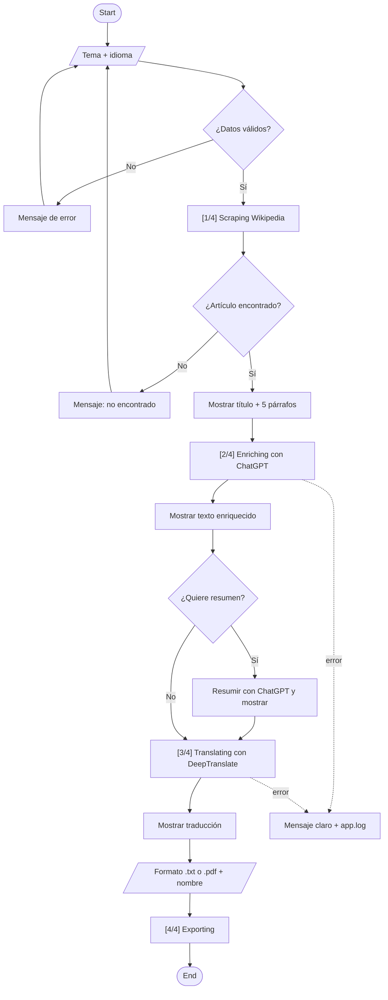
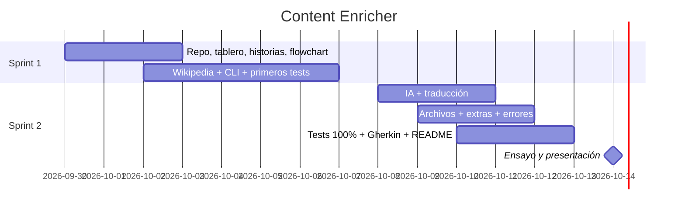

# 🔍 Content Enricher — Guía rápida del proyecto

> **Qué es este documento:** la "caja de herramientas" del equipo. Aquí está todo lo necesario para montar la app: qué hay que hacer, qué instalar, enlaces, ejemplos de código y plantillas.
>
> **Basado en:** enunciado de la profe (`Content_Enrichment.pdf`) + `Plan de Trabajo` + `SOUL.md` (reglas técnicas del equipo).
>
> **Leyenda:**
> - ✅ **DECIDIDO** → ya acordado en el plan de trabajo o en el SOUL.md.
> - 🟡 **DECIDIR** → lo tiene que decidir el equipo (cambiadlo cuando lo tengáis claro).
> - ⚠️ **COMPROBAR** → dato que conviene revisar antes de usarlo.

---

## 📅 De un vistazo

| | |
|---|---|
| **Qué** | App de terminal en Python: Wikipedia → IA → traducción → .txt / .pdf |
| **Duración** | 2 semanas: **30 sep – 14 oct 2026** |
| **Sprint 1** | 30 sep – **7 oct** → estructura, Wikipedia, menú de terminal, primeros tests |
| **Sprint 2** | 8 oct – **14 oct** → IA, traducción, archivos, extras, 100% tests, presentación |
| **Entrega y demo** | **14 de octubre** |
| **Equipo** | 4-5 developers de Python con Scrum |

---

## 📑 Índice

1. [La app en 1 minuto](#1--la-app-en-1-minuto)
2. [Decisiones del equipo](#2--decisiones-del-equipo)
3. [Equipo y roles](#3--equipo-y-roles)
4. [Checklist de requisitos](#4--checklist-de-requisitos)
5. [Herramientas que hay que instalar](#5--herramientas-que-hay-que-instalar)
6. [APIs y servicios externos](#6--apis-y-servicios-externos)
7. [Cómo se organiza el código](#7--cómo-se-organiza-el-código)
8. [Reglas de código del equipo](#8--reglas-de-código-del-equipo)
9. [Flujo de la app (flowchart)](#9--flujo-de-la-app-flowchart)
10. [Git y Gitflow paso a paso](#10--git-y-gitflow-paso-a-paso)
11. [Scrum: plan, historias y kanban](#11--scrum-plan-historias-y-kanban)
12. [Tests (pytest + Gherkin)](#12--tests-pytest--gherkin)
13. [Claves secretas (.env)](#13--claves-secretas-env)
14. [README del repositorio](#14--readme-del-repositorio)
15. [Presentación final](#15--presentación-final)
16. [Checklist de entregables](#16--checklist-de-entregables)
17. [Enlaces rápidos](#17--enlaces-rápidos)
18. [Mini-glosario](#18--mini-glosario)

---

## 1. 🚀 La app en 1 minuto

Un programa que funciona en la **terminal** (pantalla negra de texto) y hace esto:

| Paso | Qué hace | Ejemplo |
|---|---|---|
| 1 | Pregunta un **tema** y un **idioma** | Tema: `Agujero negro` · Idioma: `inglés` |
| 2 | Busca en **Wikipedia** y saca **solo** el **título + 5 primeros párrafos** | "Agujero negro" + 5 párrafos |
| 3 | Lo muestra en pantalla | — |
| 4 | La **IA (ChatGPT)** amplía el texto **sin cambiar los datos reales** y lo muestra | Añade explicaciones y ejemplos |
| 5 | **Traduce** el texto al idioma elegido y lo muestra | "Black hole…" |
| 6 | (Extra) Pregunta si quieres **resumen** (Sí/No) | 5 líneas con lo importante |
| 7 | Pregunta **formato** (.txt / .pdf) y **nombre** del archivo, y lo guarda | `agujeros_negros.pdf` |
| 8 | Apunta todo lo que pasa en **`app.log`** | Fecha, paso y errores |

**Así se debe ver el progreso en la terminal** (regla del SOUL.md):
```
[1/4] Scraping...
[2/4] Enriching...
[3/4] Translating...
[4/4] Exporting...
```

---

## 2. 🧭 Decisiones del equipo

### Ya decididas ✅

| Tema | Decisión |
|---|---|
| Duración y sprints | 2 sprints de 1 semana (30 sep – 14 oct) |
| IA | **ChatGPT (API de OpenAI)** para enriquecer y resumir |
| Estilo de nombres | **KebabCase** (para las ramas)  y **SnakeCase** (para el código y los ficheros) |
| Traductor | **DeepTranslate API** |
| Idioma del código | **Inglés** (clases, variables, funciones y commits) |
| Mensajes de commit | **Conventional Commits**, en inglés, **máx. 72 caracteres** |
| Ramas | `main`, `develop`, `feature/<tarea>` |
| Pull Requests | Obligatorios. **Mínimo 1 compañero** revisa y los tests deben pasar |
| Push directo a `main` o `develop` | **Prohibido** |
| Tests | 100% de cobertura · un `.feature` (Gherkin) **por cada historia de usuario** · **prohibido** llamar a OpenAI o DeepTranslate de verdad en los tests |
| Log | Obligatorio, archivo `app.log` |
| Calidad de código | Type hints · docstrings · nada de "números mágicos" (ver [apartado 8](#8--reglas-de-código-del-equipo)) |
| Columnas del kanban | To Do · In Progress · Code Review · Testing · Done |
| Tablero | Jira |
| Idioma de los mensajes en terminal| Español |

### Pendientes 🟡

| Tema | Opciones | Decisión |
|---|---|---|
| Librería para PDF | **ReportLab** (la recomienda la profe) · **fpdf2** (más sencilla) | 🟡 FPDF |
| Modelo de ChatGPT | Mirar lista y precios en la web de OpenAI | 🟡 DECIDIR |
| Quién paga / de quién son las claves (OpenAI y RapidAPI) | Cuenta común o cada uno la suya | 🟡 DECIDIR |
| Formato de docstrings | Google **o** NumPy (elegir uno) | 🟡 DECIDIR |
| Versión de Python | Recomendado 3.11 o superior, **todos la misma** | 🟡 DECIDIR |
| Idioma de Wikipedia | `es` · `en` · que elija el usuario | 🟡 DECIDIR |
| Hora y canal de las dailies | Ej.: 9:30, 15 min, por Discord/Meet | 🟡 DECIDIR |
| Herramienta del flowchart | **Mermaid** (ya hecho en el [apartado 9](#9--flujo-de-la-app-flowchart)) · draw.io | 🟡 DECIDIR |

**Datos del equipo (rellenar):**

| Dato | Valor |
|---|---|
| Enlace al repositorio de GitHub | [Enlace](https://github.com/webcartaonline/Joselito.git) |
| Enlace al tablero (Jira / Trello) | [Enlace](https://gonzalezgomezjesus.atlassian.net/jira/software/projects/WIKENR/boards/67/backlog?selectedIssue=WIKENR-10&atlOrigin=eyJpIjoiNDA4OWU4ZjY5YTg2NDNjNjhkOTQ4Njc1YWEwOTI1NTUiLCJwIjoiaiJ9) |
| Canal de comunicación | Zoom y [Discord](https://discord.gg/KnHhVX8tu) |

---

## 3. 👥 Equipo y roles

| Quién | Rol | Se encarga de | Nombre |
|---|---|---|---|
| **Dev 1** | Scrum Master | Organizar el equipo, tablero y repositorio | Jesús |
| **Dev 1** | Product Owner | Comunicación con Profesora y que el proyecto siga el cauce requerido | Konsta |
| **Dev 2** | Backend Developer | Ver Jira | María |
| **Dev 3** | Backend Developer | Ver Jira | Camilo |
| **Dev 4** | Backend Developer | Ver Jira | Jesús |
| **Dev 4** | Backend Developer | Ver Jira | Konsta |

> **En sencillo:**
> - **Product Owner** → decide **qué** se hace y en qué orden.
> - **Scrum Master** → hace que el equipo **funcione** (reuniones, desbloquear problemas).
> - **QA** → comprueba que todo funciona (tests).
>
> ⚠️ En Scrum se recomienda que PO y Scrum Master sean personas distintas.

---

## 4. ✅ Checklist de requisitos

### Mínimos (obligatorios)

**Wikipedia**
- [ ] Buscar en Wikipedia el tema que escribe el usuario
- [ ] Sacar **solo** el **título** y los **5 primeros párrafos**

**Usuario (terminal)**
- [ ] Pedir **tema** e **idioma**
- [ ] Mostrar el resultado de Wikipedia **antes** de pedir nada más
- [ ] Pedir **resumen** (Sí/No), **formato** (.txt/.pdf) y **nombre** del archivo
- [ ] Mostrar el progreso `[1/4] Scraping...` etc.

**IA**
- [ ] Enriquecer el texto con ChatGPT **sin cambiar los datos reales**
- [ ] Mostrar el texto enriquecido

**Traducción**
- [ ] Traducir con **DeepTranslate API** al idioma elegido
- [ ] Mostrar la traducción

**Archivos**
- [ ] Guardar contenido **original + enriquecido + traducido**
- [ ] En **.txt** o **.pdf**, con el **nombre** que elija el usuario

### Extras ⭐
- [ ] Resumen con ChatGPT
- [ ] Elegir entre .txt o .pdf *(ya está en los mínimos: sale "gratis")*
- [ ] Log `app.log` *(el SOUL.md lo hace obligatorio)*

### Técnicos
- [ ] Python, con **clases** y **una responsabilidad por clase**
- [ ] Librerías: BeautifulSoup, Requests, OpenAI, DeepTranslate, pytest
- [ ] Gitflow + Pull Request por tarea
- [ ] Type hints + docstrings + sin números mágicos
- [ ] Tests unitarios y de integración al **100%**
- [ ] Gherkin: un `.feature` por historia, con casos de **éxito y fallo**
- [ ] Control de errores centralizado con **mensajes claros** (sin internet, API que tarda, datos mal escritos…)

---

## 5. 🧰 Herramientas que hay que instalar

| Herramienta | Para qué sirve | Enlace |
|---|---|---|
| **Python** | El lenguaje del proyecto | https://www.python.org/downloads/ |
| **Git** | Guardar versiones del código | https://git-scm.com/downloads |
| **Cuenta de GitHub** | Donde vive el código del equipo | https://github.com |
| **VS Code** (u otro editor) | Escribir el código | https://code.visualstudio.com |
| **Cuenta de OpenAI** | Clave de ChatGPT | https://platform.openai.com |
| **Cuenta de RapidAPI** | Clave de DeepTranslate | https://rapidapi.com |
| **Jira** o **Trello** 🟡 | Tablero kanban | https://www.atlassian.com/es/software/jira · https://trello.com |

### Librerías de Python

| Librería | Para qué | Instalar |
|---|---|---|
| `requests` | Pedir páginas web y hablar con APIs | `pip install requests` |
| `beautifulsoup4` | Leer el HTML de Wikipedia y sacar el texto | `pip install beautifulsoup4` |
| `openai` | Hablar con ChatGPT | `pip install openai` |
| `reportlab` **o** `fpdf2` 🟡 | Crear PDFs | `pip install reportlab` |
| `python-dotenv` | Leer las claves secretas del `.env` | `pip install python-dotenv` |
| `pytest` | Hacer tests | `pip install pytest` |
| `pytest-cov` | Medir la cobertura | `pip install pytest-cov` |
| `pytest-bdd` | Ejecutar tests escritos en Gherkin | `pip install pytest-bdd` |
| `pytest-mock` | Simular APIs en los tests | `pip install pytest-mock` |
| `logging` · `unittest.mock` | Log y simulaciones | Ya vienen con Python |

> Todas se apuntan en `requirements.txt` (una por línea) y cada miembro instala con:
> ```
> pip install -r requirements.txt
> ```

### Preparar el proyecto en tu ordenador (paso a paso)

1. Abre la terminal en la carpeta del proyecto.
2. Crea un "entorno virtual" (una caja aislada para las librerías del proyecto):
   ```
   python -m venv venv
   ```
3. Actívalo:
   - **Windows:** `venv\Scripts\activate`
   - **Mac / Linux:** `source venv/bin/activate`

   Sabrás que funciona porque aparece `(venv)` al principio de la línea.
4. Instala las librerías:
   ```
   pip install -r requirements.txt
   ```
5. Copia `.env.example`, llámalo `.env` y pon tus claves (ver [apartado 13](#13--claves-secretas-env)).

---

## 6. 🌐 APIs y servicios externos

### 6.1 Wikipedia (scraping)

No necesita clave. Se descarga la página y se "lee" con BeautifulSoup.

| Qué | Dirección |
|---|---|
| Buscar un tema | `https://es.wikipedia.org/w/index.php?search=agujero+negro` |
| Artículo directo | `https://es.wikipedia.org/wiki/Agujero_negro` |

**Cómo funciona la búsqueda:**
- Si el tema existe tal cual → Wikipedia te lleva directamente al artículo.
- Si no → te enseña una lista de resultados. Hay que coger el primero (o decir "no encontrado").

**Ejemplo mínimo:**
```python
import requests
from bs4 import BeautifulSoup

WIKIPEDIA_URL = "https://es.wikipedia.org/wiki/"
REQUEST_TIMEOUT = 10        # segundos
MAX_PARAGRAPHS = 5
# Wikipedia pide identificarse; sin esto puede bloquear la petición
HEADERS = {"User-Agent": "ContentEnricher/1.0 (class project)"}

response = requests.get(WIKIPEDIA_URL + "Python", headers=HEADERS, timeout=REQUEST_TIMEOUT)
soup = BeautifulSoup(response.text, "html.parser")

title = soup.find("h1").get_text()
paragraphs = [
    p.get_text(strip=True)
    for p in soup.select("div.mw-parser-output > p")
    if p.get_text(strip=True)          # quita los párrafos vacíos
]

print(title)
print(paragraphs[:MAX_PARAGRAPHS])
```

> ⚠️ **Trucos:** algunos párrafos vienen vacíos (se filtran arriba) y traen números de referencia tipo `[1]`, `[2]`… que conviene quitar.

---

### 6.2 DeepTranslate (traducción) ✅

| Qué | Dónde |
|---|---|
| Página de la API | https://rapidapi.com/gatzuma/api/deep-translate1 |
| Planes y precio | https://rapidapi.com/gatzuma/api/deep-translate1/pricing |

**Cómo conseguir la clave:**
1. Crear cuenta en RapidAPI.
2. Entrar en la página de Deep Translate → pestaña **Pricing** → suscribirse al plan **Basic** (gratis).
3. En la pestaña **Endpoints** aparece tu clave (`X-RapidAPI-Key`).
4. Guardarla en el `.env` (nunca en el código).

> ⚠️ **COMPROBAR** el límite de caracteres gratis del plan Basic, y que la dirección y el formato del ejemplo siguen iguales en la pestaña *Endpoints*.

**Ejemplo mínimo:**
```python
import os
import requests
from dotenv import load_dotenv

load_dotenv()  # lee el archivo .env

TRANSLATE_URL = "https://deep-translate1.p.rapidapi.com/language/translate/v2"
headers = {
    "x-rapidapi-key": os.getenv("RAPIDAPI_KEY"),
    "x-rapidapi-host": "deep-translate1.p.rapidapi.com",
    "Content-Type": "application/json",
}
payload = {"q": "Hola mundo", "source": "es", "target": "en"}

response = requests.post(TRANSLATE_URL, json=payload, headers=headers, timeout=15)
print(response.json()["data"]["translations"]["translatedText"])  # Hello world
```

**Códigos de idioma más usados** (el usuario escribe "inglés" → la app manda `en`):

| Idioma | Código | Idioma | Código |
|---|---|---|---|
| Español | `es` | Italiano | `it` |
| Inglés | `en` | Portugués | `pt` |
| Francés | `fr` | Catalán | `ca` |
| Alemán | `de` | Japonés | `ja` |

---

### 6.3 ChatGPT / OpenAI (enriquecer + resumir) ✅

| Qué | Dónde |
|---|---|
| Crear clave | https://platform.openai.com/api-keys |
| Documentación | https://platform.openai.com/docs |
| Precios | https://openai.com/api/pricing/ |

> ⚠️ La API es **de pago** (hay que meter saldo) y **no** es lo mismo que pagar ChatGPT Plus. Unos pocos euros sobran para este proyecto, pero conviene poner un **límite de gasto** en la cuenta.

**Ejemplo mínimo:**
```python
from openai import OpenAI

client = OpenAI()  # coge la clave OPENAI_API_KEY del .env

response = client.chat.completions.create(
    model="MODELO_ELEGIDO",  # 🟡 DECIDIR
    messages=[
        {"role": "system", "content": "You expand texts for students. Never change or invent facts."},
        {"role": "user", "content": f"Expand this text with simple explanations and one example:\n{text}"},
    ],
)
print(response.choices[0].message.content)
```

**Instrucciones (prompts) de ejemplo:**

| Para | Prompt |
|---|---|
| Enriquecer | "Amplía este texto para un estudiante. Añade explicaciones sencillas y un ejemplo. **No cambies ni inventes datos.**" |
| Resumir | "Resume este texto en 5 puntos cortos y claros." |

---

### 6.4 Crear archivos

| Formato | Cómo | Enlace |
|---|---|---|
| **.txt** | Python solo, sin librerías | — |
| **.pdf** | `reportlab` o `fpdf2` 🟡 | https://docs.reportlab.com · https://py-pdf.github.io/fpdf2/ |

**TXT:**
```python
with open("output/my_report.txt", "w", encoding="utf-8") as file:
    file.write(text)
```

**PDF con fpdf2 (ejemplo sencillo):**
```python
from fpdf import FPDF

pdf = FPDF()
pdf.add_page()
pdf.set_font("Helvetica", size=12)
pdf.multi_cell(0, 8, text)
pdf.output("output/my_report.pdf")
```

> ⚠️ Si se traduce a idiomas con otras letras (japonés, ruso…), el PDF necesita cargar una fuente que las tenga; si no, salen símbolos raros.

---

### 6.5 Log (`app.log`) ✅

```python
import logging

logging.basicConfig(
    filename="logs/app.log",
    level=logging.INFO,
    format="%(asctime)s | %(levelname)s | %(name)s | %(message)s",
)

logger = logging.getLogger("WikipediaScraper")
logger.info("Search started: Agujero negro")
logger.error("DeepTranslate timeout")
```

Resultado en `logs/app.log`:
```
2026-10-05 10:32:11 | INFO | WikipediaScraper | Search started: Agujero negro
2026-10-05 10:32:14 | ERROR | TranslationService | DeepTranslate timeout
```

---

## 7. 🗂️ Cómo se organiza el código

**Regla de oro:** cada clase hace **una sola cosa** (como en una cocina: uno corta, otro cocina, otro emplata).

### Clases decididas (SOUL.md) ✅

| Clase | Hace **solo** esto | Ejemplo de uso | Responsable |
|---|---|---|---|
| `WikipediaScraper` | Sacar título + 5 párrafos | `scraper.search("Python")` | Dev 2 |
| `AIEnricherService` | Enriquecer y resumir con ChatGPT | `enricher.enrich(text)` · `enricher.summarize(text)` | Dev 3 |
| `TranslationService` | Traducir | `translator.translate(text, "en")` | Dev 3 |
| `DocumentExporter` | Guardar .txt y .pdf | `exporter.export(content, "my_report", "pdf")` | Dev 4 |
| `AppLogger` | Escribir en `app.log` | `logger.info("Scraping done")` | Dev 4 |

**Piezas extra que harán falta** (🟡 confirmar nombres):

| Pieza | Para qué |
|---|---|
| CLI / menú | Preguntar al usuario y mostrar resultados (Dev 2) |
| Controlador de errores | Mensajes claros cuando algo falla (plan: paso 2.5) |
| Archivo de constantes | Guardar valores fijos (tiempos de espera, nº de párrafos…) |
| App principal | Unir todas las piezas en orden |

### Carpetas (propuesta)

```
content-enricher/
├── src/
│   ├── main.py                    # Arranca la app
│   ├── cli.py                     # Menú de terminal
│   ├── config.py                  # Constantes (nada de números mágicos)
│   ├── exceptions.py              # Errores propios y mensajes claros
│   ├── wikipedia_scraper.py       # WikipediaScraper
│   ├── ai_enricher_service.py     # AIEnricherService
│   ├── translation_service.py     # TranslationService
│   ├── document_exporter.py       # DocumentExporter
│   └── app_logger.py              # AppLogger
├── tests/
│   ├── unit/                      # Cada pieza por separado
│   ├── integration/               # Piezas trabajando juntas
│   └── features/                  # Un .feature por historia de usuario
├── docs/                          # Flowchart, historias, capturas
├── output/                        # Archivos generados (no se suben)
├── logs/                          # app.log (no se sube)
├── .env.example
├── .gitignore
├── requirements.txt
└── README.md
```

> Los nombres de **archivos** van en `snake_case` porque Python no puede importar archivos con guiones.

---

## 8. 📏 Reglas de código del equipo

| Regla | Qué significa | Ejemplo |
|---|---|---|
| **Todo en inglés** | Clases, variables, funciones y commits | `translate_text`, no `traducir_texto` |
| **Nombres claros** | Que se entienda sin leer el código | `paragraphs`, no `p2` |
| **Type hints** | Decir qué tipo de dato entra y sale | `def translate(text: str, target: str) -> str:` |
| **Docstrings** | Explicación al principio de cada clase y función pública | Ver abajo |
| **Nada de números mágicos** | Los valores fijos van en constantes con nombre | `MAX_PARAGRAPHS = 5` en vez de un `5` suelto |
| **Claves en `.env`** | Nunca escritas en el código | `os.getenv("OPENAI_API_KEY")` |

**Ejemplo con todo junto** (docstring en formato Google 🟡):
```python
MAX_PARAGRAPHS = 5

class WikipediaScraper:
    """Extracts the title and first paragraphs from a Wikipedia article."""

    def get_paragraphs(self, html: str) -> list[str]:
        """Return the first paragraphs of an article.

        Args:
            html: Raw HTML of the Wikipedia page.

        Returns:
            A list with up to MAX_PARAGRAPHS non-empty paragraphs.
        """
        ...
```

> ⚠️ **Estilo de nombres:** el SOUL.md dice *kebab-case* (`get-title`), pero en Python eso da error (lo lee como una resta). Propuesta: `snake_case` para funciones y variables (`get_title`), `PascalCase` para clases (`WikipediaScraper`) y `MAYÚSCULAS` para constantes (`MAX_PARAGRAPHS`). 🟡 Corregir en el SOUL.md.

---

## 9. 🔀 Flujo de la app (flowchart)

Escrito en **Mermaid**: GitHub lo dibuja solo al abrir el .md. Editor online: https://mermaid.live



> ⚠️ El SOUL.md pide 5 datos al usuario (tema, idioma, formato, nombre, resumen), pero el enunciado dice que hay que **mostrar Wikipedia antes de pedir nada más**. Por eso aquí se piden **tema e idioma al principio** y el resto **después**. 🟡 Confirmar en equipo.
>
> Cada paso también escribe una línea en `app.log`.

---

## 10. 🌿 Git y Gitflow paso a paso

### Ramas ✅

| Rama | Para qué | Ejemplo |
|---|---|---|
| `main` | Versión estable. **Prohibido** subir directamente | Lo que se enseña en la demo |
| `develop` | Donde se junta el trabajo del sprint. **Prohibido** subir directamente | — |
| `feature/<tarea>` | Una rama por tarea | `feature/wikipedia-scraper` |

**Reglas:**
- Cada tarea = una rama `feature` = un **Pull Request** hacia `develop`.
- Para juntarlo: **1 compañero** lo revisa y aprueba **+** los tests pasan.

### Primera vez (cada miembro)

1. Descargar el repositorio (cambia la dirección por la vuestra):
   ```
   git clone https://github.com/USUARIO/content-enricher.git
   ```
2. Entrar en la carpeta:
   ```
   cd content-enricher
   ```
3. Ir a la rama `develop`:
   ```
   git checkout develop
   ```

### Cada vez que empiezas una tarea

1. Ponte en `develop` y descarga lo último de los compañeros:
   ```
   git checkout develop
   git pull
   ```
2. Crea tu rama para la tarea:
   ```
   git checkout -b feature/nombre-de-la-tarea
   ```
3. Programa. Cuando tengas algo que funcione, pasa los tests:
   ```
   pytest
   ```
4. Guárdalo (mensaje en inglés, máx. 72 caracteres):
   ```
   git add .
   git commit -m "feat: extract title and paragraphs from wikipedia"
   ```
5. Súbelo a GitHub:
   ```
   git push -u origin feature/nombre-de-la-tarea
   ```
6. En la web de GitHub aparece un botón **"Compare & pull request"** → elige **`develop`** como destino (no `main`) → pide revisión a un compañero.
7. Cuando lo aprueben y se junte ("merge"), vuelve al paso 1.

### Mensajes de commit (Conventional Commits) ✅

**Formato:** `tipo: qué has hecho` · en inglés · máx. 72 caracteres.

| Tipo | Significa | Ejemplo |
|---|---|---|
| `feat` | Algo nuevo | `feat: export content to pdf` |
| `fix` | Arreglo | `fix: handle accents in pdf export` |
| `test` | Tests | `test: add translation error scenarios` |
| `docs` | Documentación | `docs: add installation steps to readme` |
| `refactor` | Ordenar código sin cambiar lo que hace | `refactor: move constants to config` |
| `chore` | Configuración, dependencias | `chore: add pytest-cov to requirements` |

Guía oficial: https://www.conventionalcommits.org/es/v1.0.0/

---

## 11. 📋 Scrum: plan, historias y kanban

### Calendario ✅

| Fecha | Qué |
|---|---|
| 30 sep | Arranca Sprint 1 (sprint planning) |
| 7 oct | Fin Sprint 1 (review + retrospectiva) |
| 8 oct | Arranca Sprint 2 |
| 14 oct | Fin Sprint 2 + **presentación final** |
| Cada día | Daily de 15 min (🟡 hora y canal) |

### Tareas por sprint (del plan de trabajo) ✅

**Sprint 1 · 30 sep – 7 oct · Estructura y Wikipedia**

| Paso | Tarea | Responsable | Horas estimadas | Hecho |
|---|---|---|---|---|
| 1.1 | Crear repo, `.gitignore`, `requirements.txt`, ramas | Dev 1 | 🟡 | [ ] |
| 1.2 | Product backlog + historias de usuario | Dev 1 + todos | 🟡 | [ ] |
| 1.3 | Tablero kanban + regla de PR | Dev 1 | 🟡 | [ ] |
| 1.4 | Flowchart | 🟡 | 🟡 | [ ] |
| 1.5 | Diseño de clases (una responsabilidad cada una) | Todos | 🟡 | [ ] |
| 1.6 | `WikipediaScraper` | Dev 2 | 🟡 | [ ] |
| 1.7 | Menú de terminal (CLI) | Dev 2 | 🟡 | [ ] |
| 1.8 | Primeros tests con mocks de Wikipedia | Dev 5 / Dev 2 | 🟡 | [ ] |

**Sprint 2 · 8 – 14 oct · IA, traducción, archivos y demo**

| Paso | Tarea | Responsable | Horas estimadas | Hecho |
|---|---|---|---|---|
| 2.1 | `AIEnricherService` (enriquecer) | Dev 3 | 🟡 | [ ] |
| 2.2 | `TranslationService` (DeepTranslate) | Dev 3 | 🟡 | [ ] |
| 2.3 | Extras: resumen + `AppLogger` | Dev 3 / Dev 4 | 🟡 | [ ] |
| 2.4 | `DocumentExporter` (.txt / .pdf) | Dev 4 | 🟡 | [ ] |
| 2.5 | Control de errores centralizado | 🟡 | 🟡 | [ ] |
| 2.6 | Cobertura 100% | Dev 5 + todos | 🟡 | [ ] |
| 2.7 | Escenarios Gherkin | Dev 5 + todos | 🟡 | [ ] |
| 2.8 | README.md | Dev 1 | 🟡 | [ ] |
| 2.9 | Ensayo de la presentación | Todos | 🟡 | [ ] |

### Historias de usuario

**Formato:** *Como* [quién], *quiero* [qué], *para* [para qué].
**Estimación:** puntos de dificultad (1, 2, 3, 5, 8…). Más puntos = más difícil. 🟡 Estimar en equipo.

| ID | Historia | Criterios de aceptación (cuándo está "terminada") | Sprint | Puntos | `.feature` |
|---|---|---|---|---|---|
| HU-01 | Como usuario, quiero escribir un tema y un idioma, para investigarlo | Pide tema e idioma · no acepta vacíos · avisa si el idioma no existe | 1 | 🟡 | `user_input.feature` |
| HU-02 | Como usuario, quiero ver el título y 5 párrafos de Wikipedia | Muestra título · hasta 5 párrafos · avisa si no encuentra nada | 1 | 🟡 | `wikipedia_search.feature` |
| HU-03 | Como usuario, quiero que la IA amplíe el texto, para entenderlo mejor | Muestra texto ampliado · no cambia datos · avisa si la IA falla | 2 | 🟡 | `ai_enrichment.feature` |
| HU-04 | Como usuario, quiero traducir el texto | Traduce con DeepTranslate · lo muestra · avisa si falla | 2 | 🟡 | `translation.feature` |
| HU-05 | Como usuario, quiero guardar el resultado en .txt o .pdf con el nombre que yo quiera | Pregunta formato y nombre · el archivo tiene original, enriquecido y traducido | 2 | 🟡 | `export.feature` |
| HU-06 ⭐ | Como usuario, quiero un resumen, para repasar rápido | Pregunta Sí/No · genera y muestra resumen | 2 | 🟡 | `summary.feature` |
| HU-07 ⭐ | Como equipo, queremos un log, para saber qué pasó si algo falla | Crea `app.log` con fecha, paso y errores | 2 | 🟡 | `logging.feature` |
| HU-08 | Como usuario, quiero mensajes claros si algo falla | Sin internet, API lenta o datos mal escritos → mensaje entendible, sin que el programa se cierre de golpe | 2 | 🟡 | `error_handling.feature` |

### Roadmap (product backlog en el tiempo)


> 🟡 Ajustar los días reales cuando el equipo estime.

### Tablero kanban ✅

| 📥 To Do | 🔨 In Progress | 👀 Code Review | 🧪 Testing | ✅ Done |
|---|---|---|---|---|
| Tareas del sprint sin empezar | Alguien trabajando | PR abierto esperando revisión | Comprobando que pasan los tests | Juntado en `develop` |

---

## 12. 🧪 Tests (pytest + Gherkin)

**Qué es un test:** un pequeño programa que comprueba que otro funciona.
> Ejemplo: "si busco `Python`, el título debe ser `Python`".

| Tipo | Qué prueba | Ejemplo |
|---|---|---|
| **Unitario** | Una pieza sola | ¿El traductor devuelve texto? |
| **Integración** | Varias piezas juntas | Wikipedia → IA → traducción → archivo |
| **Éxito** | Todo va bien | El tema existe |
| **Fallo** | Algo va mal | Tema inexistente, sin internet, clave incorrecta |

> 🚫 **Regla del equipo:** en los tests está **prohibido** llamar de verdad a OpenAI o DeepTranslate. Se **simulan** con `unittest.mock` o `pytest-mock` (así no se gasta dinero y no depende de internet).

**Ejemplo de simulación (mock):**
```python
def test_translate_returns_text(mocker):
    fake_response = mocker.Mock()
    fake_response.json.return_value = {
        "data": {"translations": {"translatedText": "Hello"}}
    }
    mocker.patch("requests.post", return_value=fake_response)

    result = TranslationService().translate("Hola", "en")

    assert result == "Hello"
```

### Gherkin ✅ (un `.feature` por historia)

Se guardan en `tests/features/`. Palabras clave en inglés (más compatibles con las herramientas), texto 🟡 en español o inglés:

```gherkin
Feature: Wikipedia search (HU-02)

  Scenario: The topic exists
    Given the user enters the topic "Python"
    When the system searches Wikipedia
    Then the article title is shown
    And the first 5 paragraphs are shown

  Scenario: The topic does not exist
    Given the user enters the topic "asdfqwerzxcv"
    When the system searches Wikipedia
    Then the message "No article found" is shown
```

**Escenarios a cubrir (ir marcando):**

| Parte | ✅ Éxito | ❌ Fallo |
|---|---|---|
| Menú | [ ] Datos válidos | [ ] Tema vacío · [ ] Idioma inventado |
| Wikipedia | [ ] Artículo encontrado | [ ] No existe · [ ] Sin internet |
| IA | [ ] Devuelve texto | [ ] Clave incorrecta · [ ] Sin saldo · [ ] Tarda demasiado |
| Traducción | [ ] Traduce | [ ] Clave incorrecta · [ ] Idioma no soportado · [ ] Tarda demasiado |
| Resumen | [ ] Sí → lo hace · [ ] No → lo salta | [ ] La IA falla |
| Archivos | [ ] Guarda .txt · [ ] Guarda .pdf | [ ] Nombre no válido · [ ] Sin permisos |
| Log | [ ] Escribe líneas | [ ] Carpeta `logs/` no existe |

### Comandos

| Para | Comando |
|---|---|
| Pasar todos los tests | `pytest` |
| Ver la cobertura | `pytest --cov=src --cov-report=term-missing` |

> La columna **Missing** dice qué líneas faltan por probar. Objetivo: **100%**.

---

## 13. 🔐 Claves secretas (.env)

Las claves son como contraseñas: **nunca** se suben a GitHub. Si se suben, cualquiera puede gastar vuestro saldo de OpenAI.

**`.env.example`** (este SÍ se sube, sin claves reales):
```
OPENAI_API_KEY=your_key_here
RAPIDAPI_KEY=your_key_here
```

**`.env`** (este NO se sube; cada uno tiene el suyo con claves reales).

**`.gitignore`** (lista de lo que Git ignora):
```
.env
venv/
__pycache__/
output/
logs/
.coverage
htmlcov/
```

> ⚠️ Crear el `.gitignore` **antes** del primer commit (paso 1.1).

---

## 14. 📘 README del repositorio

Checklist (paso 2.8):

- [ ] Nombre del proyecto y qué hace (2-3 líneas)
- [ ] Captura o ejemplo de uso en la terminal
- [ ] Requisitos (versión de Python, cuentas de OpenAI y RapidAPI)
- [ ] Instalación en local paso a paso (clonar, venv, `pip install`, `.env`)
- [ ] Cómo ejecutar la app (`python src/main.py`)
- [ ] Cómo pasar los tests y ver la cobertura
- [ ] Arquitectura: las 5 clases y qué hace cada una
- [ ] Librerías usadas y para qué
- [ ] Miembros del equipo y roles
- [ ] Enlaces: tablero, flowchart, historias de usuario

---

## 15. 🎤 Presentación final — 14 de octubre

| Bloque | Tiempo | Contenido | Quién |
|---|---|---|---|
| Funcionalidad | 5 min | Demo en directo de la app | 🟡 |
| Análisis | 5 min | Funcional (qué hace), técnico (cómo) y gestión (Scrum, tablero, sprints) | 🟡 |
| Código + preguntas | 20 min | Recorrido por el código y los tests | 🟡 |

> ⚠️ **COMPROBAR con la profe:** tanto el enunciado como el plan hablan de "15 min", pero los bloques suman **30 min**.
>
> 💡 Tened un **plan B** para la demo (vídeo grabado o capturas) por si falla internet o una API.

---

## 16. 📦 Checklist de entregables (antes del 14 oct)

- [ ] Repositorio en GitHub con Gitflow e historial de Pull Requests
- [ ] README.md completo
- [ ] Flowchart
- [ ] Historias de usuario con criterios de aceptación
- [ ] Product backlog con roadmap
- [ ] Tablero kanban + sprint backlog con estimaciones
- [ ] Un `.feature` Gherkin por historia (éxito y fallo)
- [ ] Tests unitarios y de integración al 100%
- [ ] Presentación ensayada

---

## 17. 🔗 Enlaces rápidos

**Del enunciado (recursos de la profe)**
- Requests: https://docs.python-requests.org/en/master/
- BeautifulSoup: https://www.crummy.com/software/BeautifulSoup/bs4/doc/
- Pandas: https://pandas.pydata.org/ *(no es obligatorio; útil solo si manejamos tablas)*
- ReportLab (guía PDF): https://reportlab.com/docs/reportlab-userguide.pdf

**APIs**
- DeepTranslate (RapidAPI): https://rapidapi.com/gatzuma/api/deep-translate1
- OpenAI – claves: https://platform.openai.com/api-keys
- OpenAI – documentación: https://platform.openai.com/docs

**Librerías**
- fpdf2: https://py-pdf.github.io/fpdf2/
- python-dotenv: https://pypi.org/project/python-dotenv/
- logging: https://docs.python.org/es/3/howto/logging.html
- Type hints: https://docs.python.org/es/3/library/typing.html
- Docstrings estilo Google: https://google.github.io/styleguide/pyguide.html#38-comments-and-docstrings

**Tests**
- pytest: https://docs.pytest.org
- pytest-cov: https://pytest-cov.readthedocs.io
- pytest-bdd (Gherkin): https://pytest-bdd.readthedocs.io
- pytest-mock: https://pytest-mock.readthedocs.io
- unittest.mock: https://docs.python.org/es/3/library/unittest.mock.html
- Referencia Gherkin: https://cucumber.io/docs/gherkin/reference/

**Git y gestión**
- Gitflow explicado: https://www.atlassian.com/es/git/tutorials/comparing-workflows/gitflow-workflow
- Conventional Commits: https://www.conventionalcommits.org/es/v1.0.0/
- Pull Requests en GitHub: https://docs.github.com/es/pull-requests
- Jira: https://www.atlassian.com/es/software/jira
- Trello: https://trello.com
- Mermaid (diagramas): https://mermaid.live

---

## 18. 📖 Mini-glosario

| Palabra | Significa | Ejemplo |
|---|---|---|
| **API** | Un "camarero" entre programas: le pides algo y te lo trae | Pides "traduce Hola a inglés" y te trae "Hello" |
| **Clave de API** | Contraseña para usar una API | `OPENAI_API_KEY=sk-…` |
| **Scraping** | Leer una web con un programa y quedarse con el texto útil | Sacar los párrafos de Wikipedia |
| **HTML** | El "esqueleto" de una página web | `<p>Esto es un párrafo</p>` |
| **Terminal / CLI** | Pantalla de texto donde se escriben órdenes | Donde escribes `python src/main.py` |
| **LLM** | Una IA que entiende y escribe texto | ChatGPT |
| **Librería** | Código hecho por otros que puedes reutilizar | `requests` para descargar webs |
| **Clase** | Un "molde" que agrupa datos y acciones de una misma cosa | `TranslationService` sabe traducir |
| **SRP** | Cada clase hace una sola cosa | El traductor no guarda archivos |
| **Type hint** | Etiqueta que dice qué tipo de dato es | `text: str` → es texto |
| **Docstring** | Explicación escrita dentro del código | `"""Translates a text."""` |
| **Número mágico** | Un número suelto sin explicar | Un `5` sin saber qué es |
| **Entorno virtual (venv)** | Caja aislada con las librerías del proyecto | Aparece `(venv)` en la terminal |
| **Commit** | Una "foto" guardada del código | `feat: export content to pdf` |
| **Rama** | Copia paralela del código para trabajar sin molestar | `feature/pdf-export` |
| **Pull Request (PR)** | Pedir que revisen tu rama y la junten | "Revisad mi parte de Wikipedia" |
| **Merge** | Juntar una rama con otra | `feature/pdf-export` → `develop` |
| **Test** | Programa que comprueba que otro funciona | ¿Sale el título correcto? |
| **Cobertura** | % del código que los tests comprueban | 100% = todo probado |
| **Mock** | Una API "de mentira" para los tests | Simula la respuesta de DeepTranslate |
| **Gherkin / BDD** | Tests escritos casi como frases normales | Given… When… Then… |
| **Log** | Diario de lo que hace la app | `10:32 ERROR DeepTranslate timeout` |
| **Prompt** | La instrucción que le das a la IA | "Resume en 5 puntos" |
| **Sprint** | Periodo corto de trabajo con objetivos fijos | 30 sep – 7 oct |
| **Backlog** | Lista de todo lo que hay que hacer | Las historias HU-01 a HU-08 |
| **Timeout** | Cuando una API tarda demasiado y se deja de esperar | DeepTranslate no responde en 15 s |
