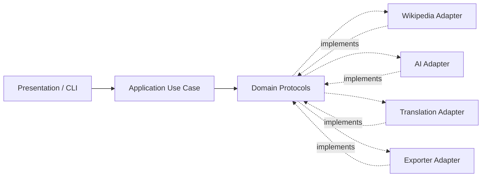

# Architecture

The `wiki_enrichment` project uses Ports and Adapters (Hexagonal Architecture)
with Pure Dependency Injection. The core workflow is independent of network
clients, AI SDKs, translation libraries, and document-generation libraries.

## Layer boundaries

- **Domain** contains immutable business models, protocol ports, and
  domain-level exceptions. It has no dependency on infrastructure.
- **Application** contains use cases that coordinate domain ports. It receives
  all collaborators through its constructor and imports no concrete adapters.
- **Infrastructure** contains provider-specific adapter implementations. The
  document exporter writes real TXT and PDF files (PDFs use `fpdf2` with the
  bundled DejaVu font in `infrastructure/fonts/`); the AI and translation
  adapters are still placeholders.
- **Presentation** is the CLI (`cli.py`) or any other user-facing entry point.
  It obtains a fully wired orchestrator from
  `wiki_enrichment.bootstrap.build_orchestrator`, which is the only module that
  instantiates concrete adapters, and talks exclusively to the application
  layer.

## Dependency direction

Dependencies point inward: presentation and infrastructure may depend on
application and domain contracts, while the domain depends on neither. Ports
are defined as `typing.Protocol` interfaces, so adapters use structural
subtyping and do not need to inherit from a base class.

The application orchestrator follows this sequence:

1. Fetch an article through `WikipediaSource`.
2. Enrich it through `ContentEnricher`.
3. Translate the generated summary through `Translator`.
4. Export the completed value through `DocumentExporter`.

`export_path` is treated as a base path; the orchestrator requests
`<export_path>.txt` and `<export_path>.pdf`.

`export_document(content, export_format, path)` exports a single document in
the format chosen by the user (`"TXT"` or `"PDF"`); `path` already includes the
extension. The CLI saves files inside the `output/` folder.

`fetch_article(topic)` exposes only the first step, so the CLI can show the
article while the enrichment, translation, and export stages are still in
progress.

## Flow

